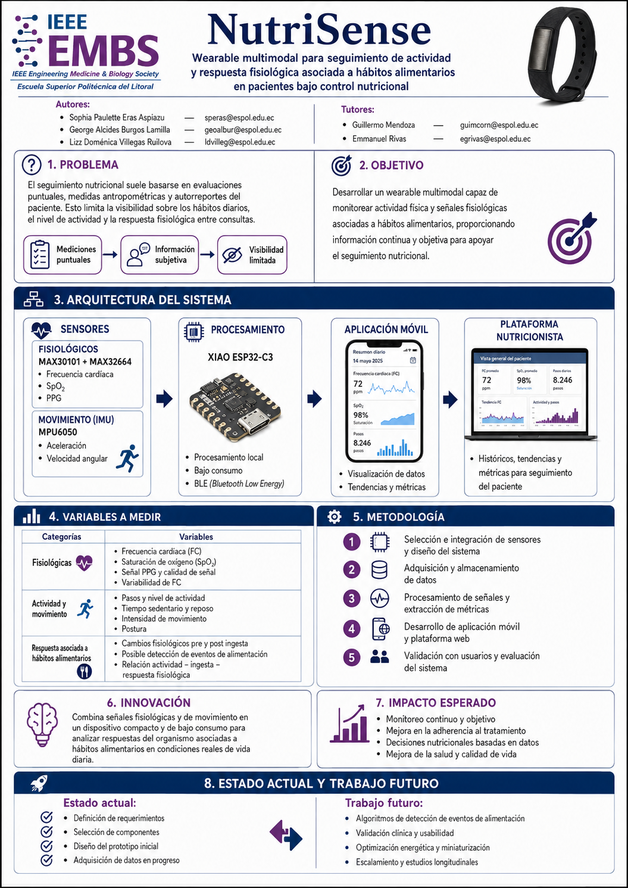

<div align="center">

# NutriSense 🫀🥗
### Plataforma de Monitoreo Fisiológico Nutricional y Análisis Postprandial Multimodal
**Desarrollado en el marco del Capítulo Estudiantil IEEE EMBS — Escuela Superior Politécnica del Litoral (ESPOL)**

[](https://react.dev/)
[](https://www.typescriptlang.org/)
[](https://vitejs.dev/)
[](https://tailwindcss.com/)
[](LICENSE)
[](https://github.com/GuillermoMendozaC/NutriSense)

<br/>



</div>

---

## 📌 Descripción General

**NutriSense** es una solución telemétrica y clínica integral diseñada para cuantificar de manera objetiva la respuesta fisiológica postprandial y el balance energético diario mediante un prototipo wearable no invasivo acoplado a un panel analítico interactivo de alta fidelidad.

A diferencia de los monitores de actividad convencionales o los diarios de comida autodeclarados, NutriSense implementa un enfoque de **detección multimodal**:
1. **Fotopletismografía de alta sensibilidad (PPG)**: Captura la respuesta cronotrópica y hemodinámica posterior a la ingesta (elevación $\Delta\text{FC}$, variabilidad del pulso $\text{PRV}$ e índice de perfusión $\text{PI}$).
2. **Iniciativa inercial (IMU 6-DOF)**: Discrimina la cinemática gestual de ingesta en la muñeca frente al movimiento basal y la locomoción diaria, permitiendo desambiguar la taquicardia inducida por ejercicio del gasto metabólico postprandial (termogénesis inducida por la dieta).
3. **Dashboard Clínico Especializado**: Provee a nutricionistas y profesionales de la salud una interfaz editorial rigurosa para evaluar el cumplimiento del paciente, validar eventos de ingesta y analizar la evolución longitudinal de la salud cardiometabólica.

---

## 🔬 Fundamentos Fisiológicos y Métricas Clave

NutriSense traduce señales crudas de fotopletismografía y acelerometría en biomarcadores clínicos directos:

| Biomarcador | Definición Fisiológica | Relevancia Clínica |
| :--- | :--- | :--- |
| **$\Delta\text{FC}$ Postprandial** | Incremento de la frecuencia cardíaca respecto a la línea base basal ($\text{bpm}$). | Correlaciona con la magnitud calórica, carga glucémica del alimento y demanda esplácnica. |
| **Tiempo de Recuperación** | Minutos transcurridos desde el pico postprandial hasta el retorno a la FC basal. | Evalúa la reactividad del sistema nervioso autónomo y la eficiencia metabólica. |
| **Índice de Perfusión ($\text{PI}$)** | Relación pulsátil/no pulsátil de la señal fotopletismográfica ($\%$). | Refleja cambios en el tono vascular periférico y vasoconstricción/vasodilatación post-ingesta. |
| **Variabilidad del Pulso ($\text{PRV}$ / $\text{RMSSD}$)** | Dispersión temporal de los intervalos pico a pico ($\text{PPI}$). | Reflejo del balance simpático-vagal y modulación autonómica durante la digestión. |
| **Calidad de Señal Multimodal ($\text{SQI}$)** | Porcentaje de tramos libres de ruido y artefactos de movimiento. | Asegura la validez de los algoritmos de detección antes de generar reportes diagnósticos. |

---

## 💻 Arquitectura de la Plataforma Web (Dashboard)

El dashboard ha sido desarrollado bajo un diseño editorial clínico riguroso, priorizando la legibilidad de datos telemétricos con una paleta institucional precisa:
- **Navy Principal**: `#072B4A`
- **Azul Institucional IEEE**: `#0076A8`
- **Morado EMBS**: `#782980`
- **Tipografías**: *Manrope* (jerarquía visual y editorial) e *IBM Plex Mono* (series temporales y telemetría).

### Vistas y Módulos del Sistema

1. **Jornada Fisiológica (Dashboard Principal - `/`)**:
   - Resumen longitudinal del paciente: FC en reposo, pasos activos, tiempo sedentario, ingestas del día e índice de calidad de datos.
   - **Curva fisiológica 24h interactiva**: Composición sincronizada de Frecuencia Cardíaca ($\text{bpm}$) con barras contextuales de intensidad de actividad física y marcadores de ingesta (desayuno, almuerzo, snack, cena).
   - Cronograma de comidas con estado de confirmación y resumen editorial semanal.

2. **Detalle Cinético Postprandial (Drawer Desplegable)**:
   - Ventana analítica temporal desde **$-30\text{ min}$ (pre-ingesta) hasta $+90\text{ min}$ (postprandial)** con marcador en $T_0$.
   - Monitorización del salto $\text{FC}_{\text{basal}} \to \text{FC}_{\text{máx}}$, tiempo de estabilización y actividad física previa/posterior.
   - Diagnóstico autonómico avanzado: RMSSD, SDNN y evolución de $\Delta\text{PI}$.

3. **Directorio de Pacientes (`/pacientes`)**:
   - Búsqueda en tiempo real por nombre, ID o plan dietoterapéutico.
   - Estado de sincronización telemétrica y conectividad del dispositivo wearable (BLE).

4. **Registro de Alimentación (`/alimentacion`)**:
   - Catálogo cronológico de ingestas con filtrado por estado (Confirmada / Pendiente / Descartada).
   - Acceso instantáneo a la respuesta cronotrópica individual de cada evento.

5. **Tendencias Longitudinales (`/tendencias`)**:
   - Evolución a mediano y largo plazo (**7, 30 y 90 días**).
   - Tendencia de frecuencia cardíaca basal, cumplimiento de actividad diaria, reducción de horas sedentarias y estabilidad de la respuesta postprandial.

6. **Parámetros del Sistema y Nivel 3 (`/configuracion`)**:
   - Calibración de metas de actividad y umbrales de alerta de taquicardia postprandial.
   - Exportación de series temporales en formato **CSV clínico** y reportes estructurados en **PDF**.
   - **Diagnóstico de Investigación (Nivel 3)**: Despliegue de oscilograma PPG normalizado en tiempo real (50 Hz), lectura de $\text{PPI}$ promedio y telemetría del hardware.

---

## 🛠️ Arquitectura de Hardware & Firmware

El prototipo físico de NutriSense integra componentes ultracompactos y de bajo consumo:

```
                  ┌───────────────────────────────────────────────────────────┐
                  │                    WEARABLE NUTRISENSE                    │
                  │                                                           │
┌──────────────┐  │  ┌───────────────────────┐     ┌───────────────────────┐  │
│ Sensor Óptico│──┼─>│ MAX30101 + MAX32664   │────>│ XIAO ESP32-C3         │  │
│  PPG / SpO2  │  │  │ (Algoritmos Embebidos)│ I2C │ (MCU RISC-V + BLE 5.0)│  │
└──────────────┘  │  └───────────────────────┘     └──────────┬────────────┘  │
                  │                                           │               │
┌──────────────┐  │  ┌───────────────────────┐                │               │
│ Sensor IMU   │──┼─>│ MPU-6050              │────────────────┘               │
│ (6 Grados)   │  │  │ (Acelerómetro/Giro)   │ I2C                            │
└──────────────┘  │  └───────────────────────┘                                │
                  └───────────────────────────────────────────┼───────────────┘
                                                              │
                                                     BLE 5.0 Telemetry
                                                              │
                                                              ▼
                                                   ┌─────────────────────┐
                                                   │ Dashboard NutriSense│
                                                   │ (React + Vite Web)  │
                                                   └─────────────────────┘
```

- **MCU**: **ESP32-C3** (Seeed Studio XIAO) — Arquitectura RISC-V de 32 bits con radio BLE 5.0 integrada y gestión de energía optimizada.
- **Biometría PPG**: **Maxim MAX30101** con el coprocesador **MAX32664**, permitiendo cómputo en el borde de pulso, $\text{SpO}_2$ y confianza de señal con bajo consumo.
- **Inercial IMU**: **MPU-6050** (acelerómetro triaxial y giroscopio) a 50 Hz para perfilado cinético de la extremidad superior.

---

## 📂 Estructura del Código

```plaintext
Dashboard/
├── public/
│   ├── favicon.svg
│   ├── icons.svg
│   └── logos/               # Identidad visual ESPOL & IEEE EMBS
│       ├── embs-espol-horizontal.png
│       ├── espol-logo.png
│       └── NutriSense_Poster.png
├── src/
│   ├── assets/              # Estilos y recursos gráficos estáticos
│   ├── components/
│   │   ├── cards/           # Tarjetas modulares de datos y métricas
│   │   ├── charts/          # Gráficos Recharts (PhysiologicalDay, Postprandial, etc.)
│   │   ├── layout/          # Sidebar institucional, Topbar y Layout general
│   │   ├── tables/          # Tablas de ingestas y listas clínicas
│   │   ├── MealDetailDrawer.tsx        # Panel lateral cinético (-30 min a +90 min)
│   │   ├── PatientOverview.tsx         # Cabecera editorial y métricas clave
│   │   ├── MealTimeline.tsx            # Línea de tiempo interactiva de comidas
│   │   └── WeeklySummaryEditorial.tsx  # Análisis narrativo semanal del paciente
│   ├── data/
│   │   └── mockData.ts      # Simulación estricta de telemetría y datos de laboratorio
│   ├── pages/
│   │   ├── Dashboard.tsx    # Vista principal 24h
│   │   ├── Patients.tsx     # Directorio de pacientes
│   │   ├── Alimentacion.tsx # Historial de ingestas
│   │   ├── Trends.tsx       # Análisis longitudinal 7D/30D/90D
│   │   └── Settings.tsx     # Configuración clínica, exportación y diagnóstico L3
│   ├── services/
│   │   └── api.ts           # Capa de abstracción de datos y futuros endpoints REST
│   ├── types/
│   │   └── index.ts         # Contratos TypeScript de modelos fisiológicos
│   ├── App.tsx              # Router principal y redirecciones
│   ├── index.css            # Tokens CSS, scrollbars y utilidades de interfaz
│   └── main.tsx             # Punto de entrada de la aplicación
├── index.html
├── package.json
├── tailwind.config.js       # Tokens de diseño y paleta institucional
├── tsconfig.json
└── vite.config.ts
```

---

## 🚀 Instalación y Puesta en Marcha

### Requisitos Previos
- **Node.js**: Versión 18.0.0 o superior recomendada.
- **npm** o **pnpm** / **yarn**.

### Pasos de Instalación

1. **Clonar el repositorio**:
   ```bash
   git clone https://github.com/GuillermoMendozaC/NutriSense.git
   cd NutriSense
   ```

2. **Instalar dependencias**:
   ```bash
   npm install
   ```

3. **Ejecutar en modo de desarrollo**:
   ```bash
   npm run dev
   ```
   Accede a [http://localhost:5173](http://localhost:5173) en tu navegador para interactuar con la plataforma.

4. **Compilar para producción**:
   ```bash
   npm run build
   ```
   Los artefactos optimizados y minificados se generarán en el directorio `dist/`.

5. **Previsualizar el bundle de producción**:
   ```bash
   npm run preview
   ```

---

## 📊 Integración con Backend / API Futura

La plataforma cuenta con un servicio aislado en [`src/services/api.ts`](./src/services/api.ts) preparado para sustituir las fuentes simuladas por llamadas RESTful hacia el servidor telemétrico o pasarela IoT:

- `GET /api/patients` — Listado de pacientes asignados.
- `GET /api/patients/:id/summary` — Resumen hemodinámico y fisiológico consolidado.
- `GET /api/patients/:id/measurements` — Series de tiempo crudas e interpoladas de FC y $\text{SpO}_2$.
- `GET /api/patients/:id/meals` — Eventos de ingesta confirmados e inferidos.
- `GET /api/meals/:id/response` — Cinética de respuesta postprandial $(-30\text{ a }+90\text{ min})$.
- `GET /api/patients/:id/trends?period={7d|30d|90d}` — Agregaciones estadísticas longitudinales.
- `POST /api/measurements` — Ingesta de paquetes de telemetría BLE en tiempo real.

---

## 🏛️ Créditos y Respaldo Institucional

Proyecto concebido y desarrollado bajo el respaldo de:
- **IEEE EMBS ESPOL Student Branch Chapter** (Engineering in Medicine and Biology Society).
- **Escuela Superior Politécnica del Litoral (ESPOL)** — Guayaquil, Ecuador.

---

## 📄 Licencia

Este proyecto se encuentra bajo la licencia **MIT**. Consulta el archivo `LICENSE` para mayores detalles.
